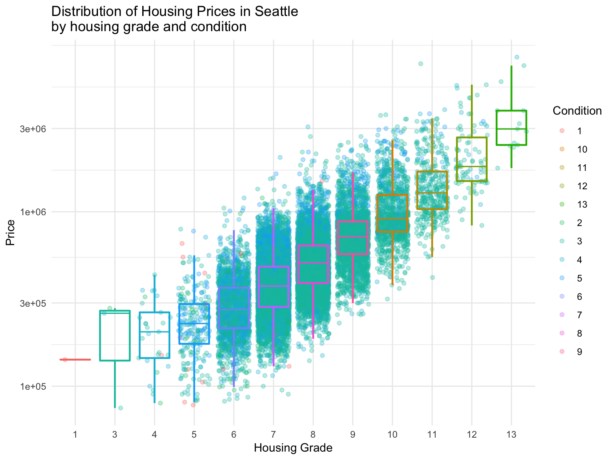

Seattle Housing Prices
----------------------



``` r
library(ggplot2)
library(moderndive)
houses <- house_prices
ggplot(houses, aes(x = grade, y = price)) +
   geom_jitter(aes(col = condition), alpha = 0.3) +
   geom_boxplot(aes(col = grade), 
                alpha = 0.01, 
                lwd = .8,
                fatten = .7,
                outlier.shape = NA, 
                show.legend = FALSE) +
   labs(x = "Housing Grade", y = "Price", col = "Condition",
        title = "Distribution of Housing Prices in Seattle \nby housing grade and condition") +
   scale_y_log10() + 
   theme_minimal()
```
