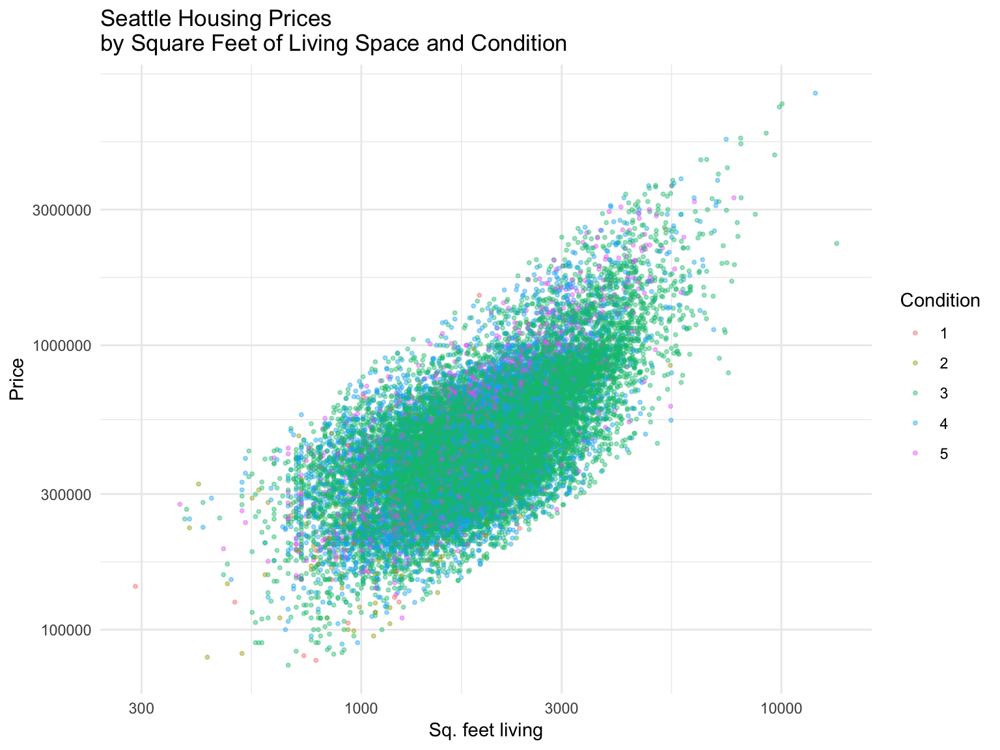

House Sales in Seattle (King County)
------------------------------------

The Seattle House Sale data, which contains house sale prices for King County, which includes Seattle. It includes homes sold between May 2014 and May 2015 can be sourced on [kaggle.com](https://www.kaggle.com/harlfoxem/housesalesprediction).

The following presents an exploratory analysis of the data.

### The Data

``` r
glimpse(houses)
## Observations: 21,613
## Variables: 21
## $ id            <chr> "7129300520", "6414100192", "5631500400", "2487200…
## $ date          <dttm> 2014-10-13, 2014-12-09, 2015-02-25, 2014-12-09, 2…
## $ price         <dbl> 221900, 538000, 180000, 604000, 510000, 1225000, 2…
## $ bedrooms      <int> 3, 3, 2, 4, 3, 4, 3, 3, 3, 3, 3, 2, 3, 3, 5, 4, 3,…
## $ bathrooms     <dbl> 1.00, 2.25, 1.00, 3.00, 2.00, 4.50, 2.25, 1.50, 1.…
## $ sqft_living   <int> 1180, 2570, 770, 1960, 1680, 5420, 1715, 1060, 178…
## $ sqft_lot      <int> 5650, 7242, 10000, 5000, 8080, 101930, 6819, 9711,…
## $ floors        <dbl> 1.0, 2.0, 1.0, 1.0, 1.0, 1.0, 2.0, 1.0, 1.0, 2.0, …
## $ waterfront    <lgl> FALSE, FALSE, FALSE, FALSE, FALSE, FALSE, FALSE, F…
## $ view          <int> 0, 0, 0, 0, 0, 0, 0, 0, 0, 0, 0, 0, 0, 0, 0, 3, 0,…
## $ condition     <fct> 3, 3, 3, 5, 3, 3, 3, 3, 3, 3, 3, 4, 4, 4, 3, 3, 3,…
## $ grade         <fct> 7, 7, 6, 7, 8, 11, 7, 7, 7, 7, 8, 7, 7, 7, 7, 9, 7…
## $ sqft_above    <int> 1180, 2170, 770, 1050, 1680, 3890, 1715, 1060, 105…
## $ sqft_basement <int> 0, 400, 0, 910, 0, 1530, 0, 0, 730, 0, 1700, 300, …
## $ yr_built      <int> 1955, 1951, 1933, 1965, 1987, 2001, 1995, 1963, 19…
## $ yr_renovated  <int> 0, 1991, 0, 0, 0, 0, 0, 0, 0, 0, 0, 0, 0, 0, 0, 0,…
## $ zipcode       <fct> 98178, 98125, 98028, 98136, 98074, 98053, 98003, 9…
## $ lat           <dbl> 47.5112, 47.7210, 47.7379, 47.5208, 47.6168, 47.65…
## $ long          <dbl> -122.257, -122.319, -122.233, -122.393, -122.045, …
## $ sqft_living15 <int> 1340, 1690, 2720, 1360, 1800, 4760, 2238, 1650, 17…
## $ sqft_lot15    <int> 5650, 7639, 8062, 5000, 7503, 101930, 6819, 9711, …
```




``` r
ggplot(houses, aes(x = grade, y = price)) +
   geom_jitter(aes(col = condition), alpha = 0.3, size = 0.75) +
   geom_boxplot(color = "gray40",
                alpha = 0.01, 
                lwd = .7,
                fatten = .7,
                outlier.shape = NA, 
                show.legend = FALSE) +
   labs(x = "Housing Grade", y = "Price", col = "Condition",
        title = "Distribution of Housing Prices in Seattle \nby housing grade and condition") +
   scale_y_log10() + 
   theme_minimal()
```
